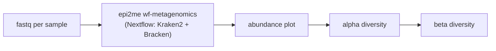

# MicroVerse-16Sense

**A Python pipeline for 16S rRNA Oxford Nanopore data.** It runs the epi2me `wf-metagenomics`
Nextflow workflow for taxonomic classification and then produces abundance, alpha-diversity and
beta-diversity plots. No Snakemake needed: a single script, `microverse.py`, runs the steps.

> This is the `python_wrapper` branch. The Snakemake version is on `main`.

## Branches

| Branch | How the pipeline is run | Notes |
|---|---|---|
| `main` | Snakemake, Nextflow step with `handover: True` | recommended |
| `python_wrapper` | plain Python script, no Snakemake | lightweight alternative |

Both versions run exactly the same Nextflow command and scripts. In a benchmark on 12 samples
(42 GB fastq) they took the same time (~15 min) and produced identical species tables. They differ in
how they behave on re-runs, see [Re-running and recovering](#re-running-and-recovering).

## Pipeline



| Step | What it does | Main output |
|---|---|---|
| epi2me | read QC, Kraken2 classification, Bracken abundance ([wf-metagenomics](https://github.com/epi2me-labs/wf-metagenomics)) | `abundance_table_species.tsv`, `bracken/` |
| abundance | combines Bracken reports, stacked bar plot of the top species | `results/composition_plot.pdf`, `results/raw_counts_for_deseq2.txt` |
| alpha diversity | Shannon, Simpson, Observed, Chao1 per group | `results/alpha_diversity_plots.pdf` (or `..._with_pvalues.pdf`) |
| beta diversity | Bray–Curtis, Jaccard, Euclidean distances + PCoA | `results/beta_diversity_plots.pdf` |

## Requirements

- Python 3 with PyYAML
- conda (the environments in `envs/*.yaml` are built on first use under `.conda_envs/`)
- Singularity/Apptainer or Docker for the epi2me containers

## Quick start

```bash
git clone -b python_wrapper git@github.com:NavandarM/MicroVerse-16Sense.git
cd MicroVerse-16Sense
# edit config.yaml
python microverse.py -c config.yaml -n   # dry run: print the commands
python microverse.py -c config.yaml
```

On an HPC module system, load the container runtime first, e.g. `module load apptainer`.

### Options

| Option | Meaning |
|---|---|
| `-c`, `--config` | config file (default: `config.yaml` next to the script) |
| `-n`, `--dry-run` | print the commands without running them |
| `--steps ...` | run only these steps: `epi2me`, `abundance`, `alpha_diversity`, `beta_diversity` |
| `--force` | rerun steps even if they are already done |
| `--no-conda` | use the tools of the current environment instead of `envs/*.yaml` |
| `--env-dir` | where the conda environments are created (default `.conda_envs/`) |

### Input

`input_dir` contains one folder per sample; the folder name is the sample name:

```
fastqs/
├── CV0834m12wFec/
│   └── CV0834m12wFec.fastq.gz
├── FMTcc4w0864m11wFec/
│   └── FMTcc4w0864m11wFec.fastq.gz
└── ...
```

The metadata file is tab-separated. The first column holds the sample names (same as the folder
names), and one column holds the group used in the diversity plots (default `Group`):

```
sample	Group	mouse_id	age_weeks
CV0834m12wFec	CV	0834	12
FMTcc4w0864m11wFec	FMTcc4w	0864	11
```

### Configuration (`config.yaml`)

| Key | Required | Description |
|---|---|---|
| `input_dir` | yes | folder with one sub-folder of fastq files per sample |
| `output_dir` | yes | where everything is written (end with `/`) |
| `metadata_file` | yes | sample metadata, see above |
| `storage_dir` | recommended | where epi2me stores the downloaded database and taxonomy; reused by later runs |
| `database_dir`, `taxonomy_dir` | optional | use your own Kraken2 database / taxonomy instead of the download |
| `profile_tool` | optional | Nextflow profile: `singularity` (default) or `standard` (docker) |
| `nextflow_config` | optional | extra Nextflow config file, e.g. to run on a cluster (see below) |
| `group_col` | optional | metadata column for groups (default `Group`) |
| `top_n` | optional | number of species in the composition plot (default `10`) |
| `show_pvalues` | optional | p-values on the alpha diversity plots (default `true`) |
| `beta_metrics` | optional | default `braycurtis,jaccard,euclidean` |
| `clr_flags` | optional | CLR transform per beta metric, default `False,False,False` |

### Output

```
output_dir/
├── abundance_table_species.tsv    # species x sample counts (epi2me)
├── bracken/  kraken2/             # per-sample reports (epi2me)
├── wf-metagenomics-report.html    # epi2me report
├── execution/                     # Nextflow trace, timeline, report
├── results/                       # plots and count table from the Python scripts
├── log/nextflow.log
├── flags/                         # <step>.done markers
└── nf_work/                       # Nextflow work dir (large, can be deleted when finished)
```

### Running Nextflow on a cluster

Point `nextflow_config` to a Nextflow config, for example:

```groovy
process.executor = 'slurm'
process.queue    = 'normal'
```

Nextflow then submits its own jobs; everything else runs on the machine where you start the pipeline.

## Re-running and recovering

Every finished step writes `output_dir/flags/<step>.done` and is skipped on the next run. When a step
runs again, all steps after it run again too.

| Situation | What to do |
|---|---|
| Interrupted (Ctrl-C, crash, `kill -9`) | run the same command again; Nextflow resumes (`-resume`) and reuses finished tasks |
| A step failed | fix the cause and run again; finished steps are not repeated |
| A setting in `config.yaml` changed | **not detected automatically**: rerun the affected steps, e.g. `--steps alpha_diversity beta_diversity --force` |
| Rerun everything | `--force` |

## Individual scripts

Apart from the pipeline, you can also use the individual scripts to perform **abundance**, **alpha diversity**, and **beta diversity** analyses.

### Abundance plot

**Script:**  
`scripts/plot_abundance.py`

**Usage:**  
```bash
python scripts/plot_abundance.py <input_dir> <output_dir> [top_n]
```
Inputs:
- input_dir: Path to the directory containing *.kraken2_bracken.report files.
- output_dir: Directory to save the results.
- top_n (default = 10): Number of top species to display in the stacked bar plot. (optional) <br>

Output:
- raw_counts_for_deseq2.txt: Combined species-level count table for all samples.
- composition_plot.pdf: Stacked bar plot showing relative abundances of the top species across samples, saved in the specified output directory.

**Example**
`python scripts/plot_abundance.py data/kraken_reports/ results/ 10`

**Description:**  
Reads **Bracken/Kraken2** report files (`*.kraken2_bracken.report`) from a directory, aggregates **species-level abundances**, and generates:  
- A **combined count table** (for DESeq2 or downstream analyses)  
- A **stacked bar plot** showing the top 10 most abundant species per sample  

---

### Alpha Diversity
**Script:**  
`scripts/alpha_diversity.py`

**Usage:**  
```bash
python scripts/alpha_diversity.py <abundance_file> <metadata_file> <output_dir> [group_col] [show_pvalues]
```
**Example:**
`python scripts/alpha_diversity.py data/abundance.tsv data/metadata.tsv results/ Group 1`

Inputs:
- abundance_file: Tab-delimited table of species/OTU counts (rows = species, columns = samples).
- metadata_file: Tab-delimited metadata linking samples to experimental groups.
- output_dir: Directory for saving results.
- group_col (default = "Group"): Column in metadata to define sample groups. (optional)
- show_pvalues (default = 0): Whether to display p-values on the plots (0 = no, 1 = yes). (optional)

Output:
- alpha_diversity_plots.pdf or alpha_diversity_with_pvalues.pdf: Boxplots summarizing alpha diversity metrics (Shannon, Simpson, Observed OTUs, Chao1) per sample group.

**Description:**  
Calculates alpha diversity metrics (**Shannon**, **Simpson**, **Observed**, **Chao1**) from a species abundance table, and generates grouped boxplots with optional p-value annotations.

---

### Beta Diversity

**Script:**  
`scripts/beta_diversity.py`

**Usage:**  
```bash
python scripts/beta_diversity.py <abundance_file> <metadata_file> <output_dir> [group_col] [metrics_comma_separated] [clr_flags_comma_separated]
```
**Example**
`python scripts/beta_diversity.py data/abundance.tsv data/metadata.tsv results/ Group braycurtis,jaccard,euclidean false,false,false`

Inputs:
- abundance_file: Tab-delimited table of species/OTU counts (rows = species, columns = samples).
- metadata_file: Tab-delimited metadata linking samples to experimental groups.
- output_dir: Directory to save results.
- group_col (default = "Group"): Column in metadata for grouping samples. (optional)
- metrics_comma_separated (default = "braycurtis,jaccard,euclidean"): Beta diversity metrics to compute. (optional)
- clr_flags_comma_separated (default = false,false,false): Whether to apply CLR transformation for each metric (true or false). (optional)

Output:
- beta_diversity_plots.pdf: PCoA scatterplots for the selected beta diversity metrics, colored by sample group, saved in the specified output directory.
  
**Description:**  
Computes beta diversity metrics (**Bray–Curtis**, **Jaccard**, **Euclidean**, and **UniFrac**) from an abundance table, performs **Principal Coordinates Analysis (PCoA)**, and plots PCoA scatterplots with non-overlapping sample labels.
